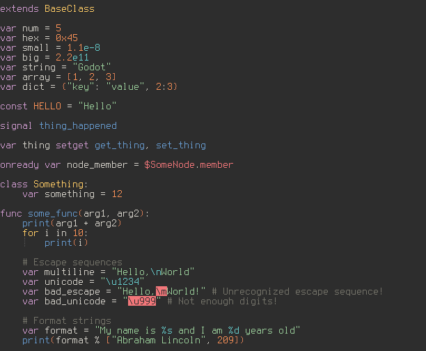

# Description
GDScript is the primary scripting language used by the [Godot Game Engine](https://godotengine.org/).

This plugin adds syntax highlighting for the most recent version (3.0 at the time of writing).

# Installation
Using [vim-plug](https://github.com/junegunn/vim-plug):

    Plug 'calviken/vim-gdscript3'
    
Or any other plugin manager of your choice.

# Screenshot

*Colorscheme: [base16-eighties](https://github.com/chriskempson/base16-vim)*

# Completion
Vim's completion feature can be used to display members and methods of built-in GDScript types (among other things).

To show completions, press `<C-x><C-o>` in insert mode, and use `<C-n>` and `<C-p>` to cycle through completions.

Alternatively, install a completion plugin (recommended). The following plugins are supported out of the box:

1. [SuperTab](https://github.com/ervandew/supertab): Shows completions when Tab is pressed.
2. [Deoplete](https://github.com/Shougo/deoplete.nvim): Asynchronous completion framework that shows completions as you type. 

Any plugin that supports omnicompletion should also work, but will likely require more configuration.

[echodoc](https://github.com/Shougo/echodoc.vim) is also supported, for showing method signatures in the echo area (useful for methods with lots of parameters).

# License
MIT
